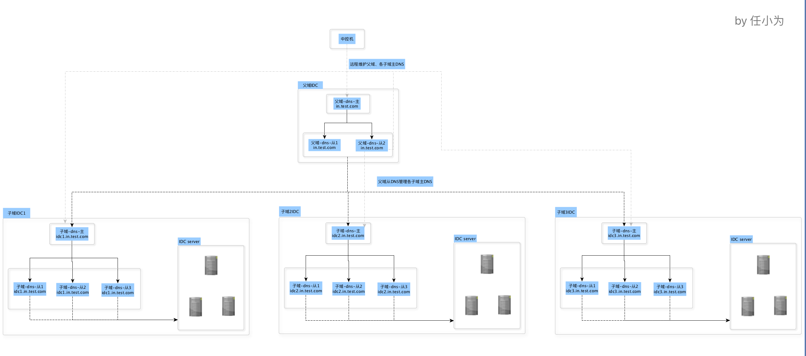

本仓库为bind相关部署文档。

一个好的域名体系可以做到事半功倍的效果，体现如下：

 1.程序配置（包括代码、服务等配置）使用域名可以实现平滑升级或迁移；
 
 2.标准化管理；
 
 3.方便记忆，易维护等。

提供域名服务的软件有很多，bind是其中最为出色的一款产品，其特点表现为稳定、开源、易维护等，我选择bind作为域名系统方案。

我采用父域控制子域，主域同步从域，从域提供服务，远程维护父域主服务、各子域主服务方式实现域名系统安全稳定的运转，各客户端使用相应子域从dns服务。简要拓扑如下： 

实现功能罗列为：

1.父域控制子域，各域均有主从之分，主服务负责接受并传输控制命令，从服务负责服务各客户端。父域名：in.test.com;子域名：idc1.in.trc.com、idc2.in.trc.com ...

2.各named.conf更改后均由rndc生效（不允许bind服务重启生效）；各zone文件更改后均通过远程工具nsupdate生效（不允许bind服务重启生效）；

3.关于正向、反向解析，各客户端均可以正常解析到；

4.各从dns服务zone文件均只能从相应的主dns服务同步，且不得修改从dns服务zone文件，只能修改主dns zone文件实现更改；

5.各从子域服务运行客户端递归查询，允许客户端访问公网；各主子域服务、父域所有服务不允许客户端递归查询外网服务，不允许客户端访问公网；
各辅子域服务充当“从dns”的同时，也充当缓存dns、转发dns功能；

6.父域辅服务规划2台服务器提供服务，各子域辅服务各规划3台服务器提供服务，各linux客户端配置轮询相应的3台子域辅服务，最大超时时间设定为1s；不对各辅dns设置“HA”主备模式（会增加复杂度，且可行性不高）；

7.关于客户端访问控制：通过bind的acl及视图功能实现网段或主机是否允许访问；

8.关于域名修改：通过中控制远程维护主父域、各子主域服务，实现域名增删改；关于各主服务配置修改：使用rndc工具本地或远程生效，不允许重启服务；

